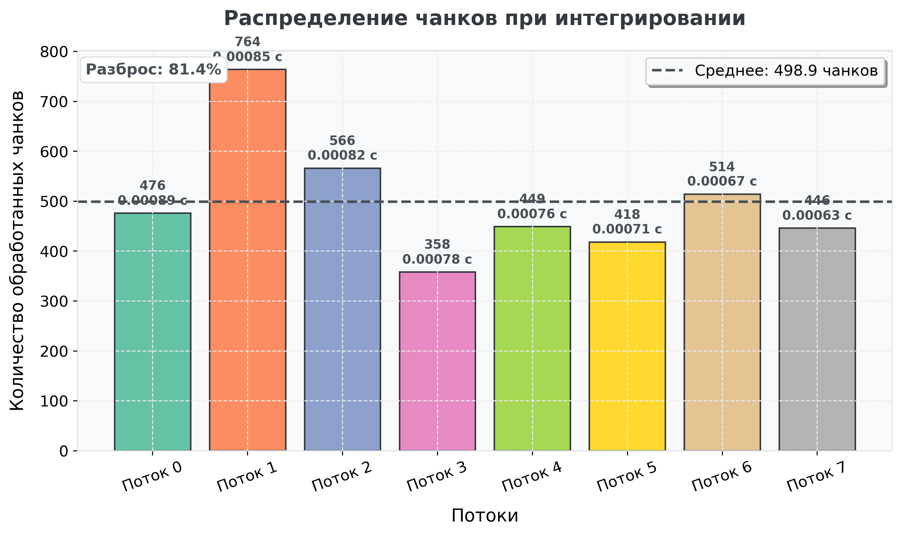
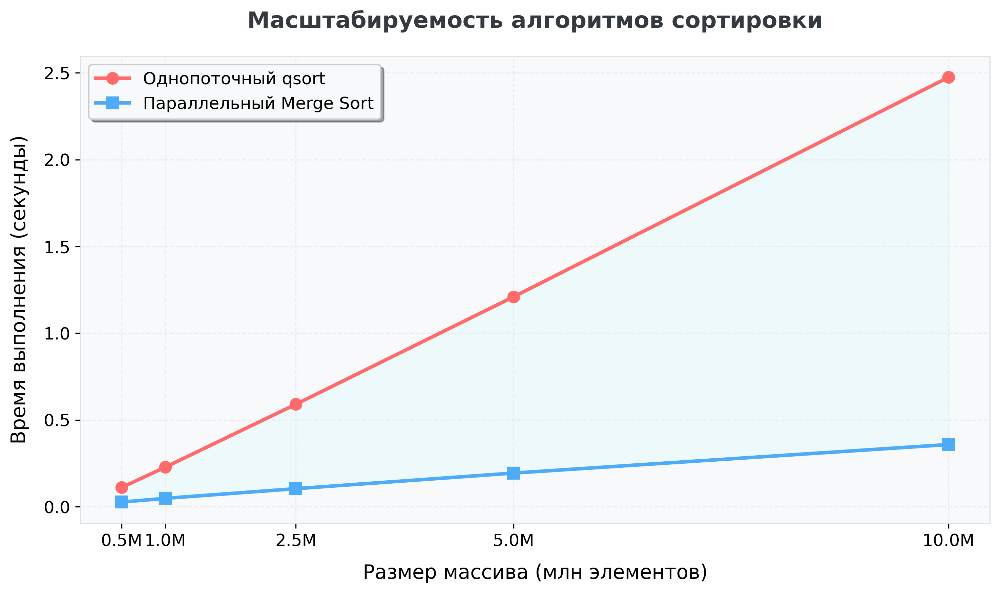
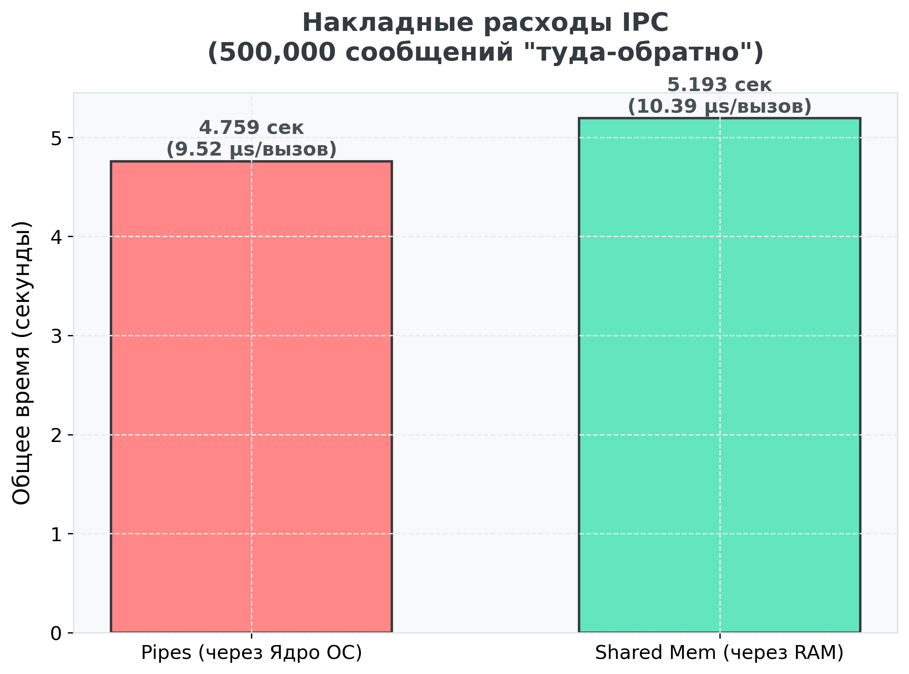

# Лабораторная работа 2

В работе рассматриваются три задачи

- `sort.c` - параллельная сортировка массива и сравнение с `qsort`;
- `integral.c` - параллельное численное интегрирование функции `sin(1/x)`;
- `ipc.c` - сравнение обмена данными через `pipe` и через синхронизацию потоков.

## Сборка

```bash
git clone https://github.com/nniikon/parprog
cd parprog
make
```

## Запуск

```bash
./integral
./sort 1000000
./ipc 100000
```

Графики строятся отдельным скриптом:

```bash
python3 plot.py
```

## Полученные результаты

### Интегрирование

Программа `integral.c` вычисляет интеграл функции `sin(1/x)` на отрезке от `0.01` до `4.0` с использованием 8 потоков.

Результат запуска:

```text
Интеграл sin(1/x) от 0.010 до 4.000 равен: 1.81419332
```

Потоки обрабатывают разное количество участков, потому что работа распределяется динамически. Поток, который раньше закончил текущий участок, берёт следующий.

График распределения чанков между потоками:



### Сортировка

Программа `sort.c` сравнивает параллельную сортировку слиянием со стандартной `qsort`.

Результат для массива из `1000000` элементов:

```text
PARALLEL=0.052728
QSORT=0.197547
```

Параллельная сортировка исполнилась быстрее, как и ожидалось

График зависимости времени сортировки от размера массива:



### Межпроцессное и межпоточное взаимодействие

Программа `ipc.c` сравнивает обмен короткими сообщениями через два канала `pipe` и через общую переменную с `pthread_mutex` и `pthread_cond`.

Результат для `100000` итераций:

```text
PIPES=2.341965
SHM=2.370550
```

В этом запуске время обмена через `pipe` и через синхронизацию потоков получилось близким. Разница зависит от нагрузки системы, планировщика ОС и накладных расходов синхронизации.

График сравнения IPC для `500000` итераций:

